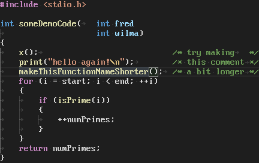

# Elastic Tabstops Mono for VS Code

## Features

A better way to indent and align code.

> Only works with monospaced fonts.

## Extension Settings

This extension contributes the following settings:

* `elasticTabstopsMono.enable`: Enable/disable Elastic Tabstops Mono.
* `elasticTabstopsMono.timeout`: Timeout in milliseconds before aligning.
* `elasticTabstopsMono.maxLineCount`: File with line count above this will not be aligned for performance reasons.
* `elasticTabstopsMono.maxLineLength`: Line length above this will not be aligned for performance reasons.

## Known Issues

This extension will destroy your code editing experience.

> Disable/uninstall immediately when you start pulling your hair out.
